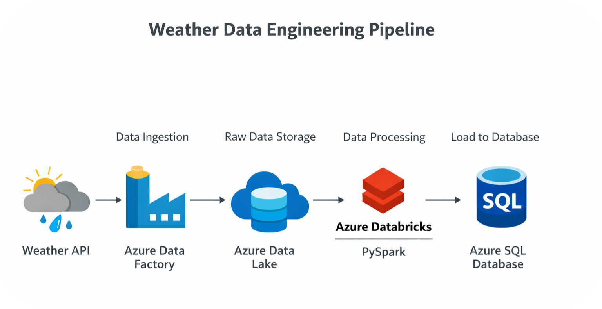

# 🌦 Weather Data Engineering Pipeline using Azure and Databricks

## 📌 Project Overview

This project demonstrates an end-to-end Data Engineering pipeline built using Azure services and Databricks.

The pipeline extracts real-time weather data from an API, stores raw data in Azure Data Lake, transforms it using PySpark, and loads processed data into Azure SQL Database.

---

## 🏗 Architecture



---

## ⚙ Technologies Used

- Azure Data Factory
- Azure Data Lake Storage
- Azure Databricks
- PySpark
- Azure SQL Database
- Python
- REST API

---

## 🔄 Pipeline Flow

1. Extract weather data from OpenWeather API
2. Store raw JSON data in Azure Data Lake
3. Transform data using Azure Databricks (PySpark)
4. Load processed data into Azure SQL Database

---

## 📂 Project Structure

```
weather-data-engineering-project/
│
├── data/
├── notebooks/
├── scripts/
├── images/
└── README.md
```

---

## 🚀 Key Features

✔ Real-time API data ingestion  
✔ Cloud-based storage  
✔ ETL pipeline implementation  
✔ Data transformation using PySpark  
✔ End-to-end pipeline  

---

## 📊 Sample Output

| City | Temperature | Humidity | Weather |
|-----|-------------|----------|---------|
| Bangalore | 29 | 70 | Clouds |

---

## 👨💻 Want to connect?

LinkedIn: https://www.linkedin.com/in/tanzil-ameen-23370521a

GitHub: https://github.com/tanzilBoi

---

## ⭐ If you like this project, please give it a star!
